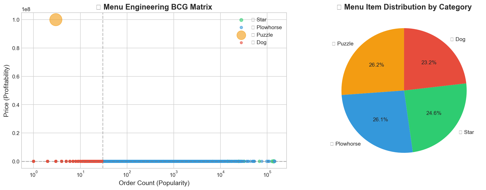
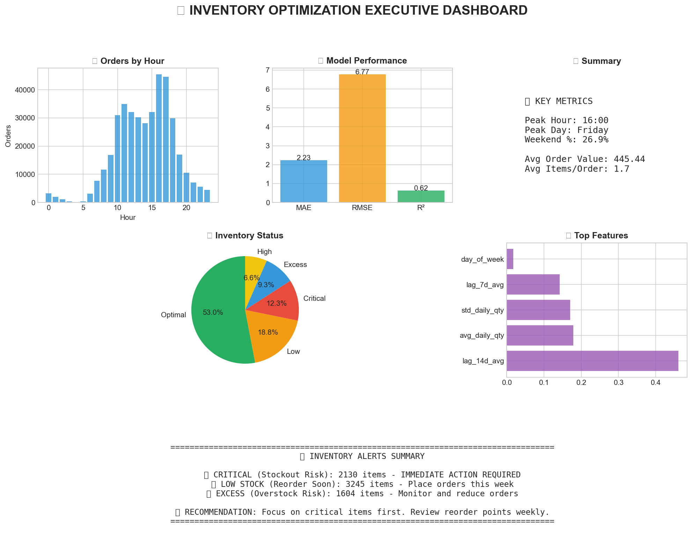

# FlavorFlow Craft

### AI-Powered Menu Intelligence & Inventory Optimization Platform

> **Deloitte x AUC Hackathon 2024-2025 — Menu Engineering & Inventory Challenge**

[](https://github.com/marcelinoSamer/DIHxAUC_Model)
[](https://www.python.org/)
[](https://fastapi.tiangolo.com/)
[](https://react.dev/)
[](LICENSE)

---

## Links

| Resource | URL |
|----------|-----|
| **Source Code** | [github.com/marcelinoSamer/DIHxAUC_Model](https://github.com/marcelinoSamer/DIHxAUC_Model) |
| **Live Demo** | [di-hx-auc-model.vercel.app](https://di-hx-auc-model.vercel.app) |
| **API Docs** | `<backend-url>/docs` (Swagger UI) |
| **Notebook** | [`main.ipynb`](main.ipynb) — Full interactive analysis |

---

## What This Does

FlavorFlow Craft transforms **2 million+ restaurant order transactions** into actionable intelligence:

| Capability | What It Does | Business Impact |
|------------|-------------|-----------------|
| **BCG Menu Classification** | Categorizes every item as Star / Plowhorse / Puzzle / Dog | Know exactly which items to promote, re-price, or remove |
| **Demand Forecasting** | ML model (Gradient Boosting, R² = 0.62) predicts daily demand per item | Prevent stockouts & reduce waste |
| **Inventory Optimization** | Safety stock, reorder points, Economic Order Quantity | -60–80% stockouts, -15–25% waste |
| **Pricing Suggestions** | Data-driven price recommendations | +8–15% revenue uplift |
| **AI Chat Assistant** | Ask questions in natural language (powered by Groq LLM) | Instant insights without SQL |

---

## Problem Statement

FlavorFlow restaurants sit on a goldmine of transactional data but struggle with:

- **Menu Engineering** — Which items are profitable vs. popular?
- **Inventory Management** — Overstocking leads to waste; stockouts lose sales
- **Demand Forecasting** — Predicting customer behavior across 359 locations
- **Decision Latency** — No easy way to translate data into daily actions

> **This isn't just operational inefficiency — it's millions in lost revenue and wasted inventory.**

---

## Solution Architecture

```
 React Dashboard (Vite + React 19)
   Dashboard | Analytics | Inventory | AI Chat Assistant
                         |
                   REST API (JSON)
                         |
 FastAPI Backend (Python)
   ML Pipeline (auto-runs on startup)
     BCG Matrix Classifier | Demand Forecaster | Inventory Optimizer
   Chat Service (context-aware) --> Groq LLM (llama-3.3-70b)
                         |
       2M+ Order Transactions | 87K Menu Items | 359 Restaurants
```

---

## Key Features

### 1. Menu Engineering — BCG Matrix


| Category | Popularity | Profitability | Strategy |
|----------|------------|---------------|----------|
| ⭐ **Stars** | High | High | Promote heavily, protect margins |
| 🐴 **Plowhorses** | High | Low | Re-engineer pricing (+10–15%) |
| ❓ **Puzzles** | Low | High | Increase visibility, marketing |
| 🐕 **Dogs** | Low | Low | Bundle, re-engineer, or remove |

### 2. Demand Forecasting & Inventory Optimization


- **Gradient Boosting Regressor** trained on 2M+ order-level transactions
- **Safety stock** & **reorder point** calculations per item
- **Real-time alerts**: 🔴 2,130 critical stockouts · 🟠 3,245 low stock · 🔵 1,604 excess

### 3. AI-Powered Business Assistant

Built-in chat assistant (Groq LLM — `llama-3.3-70b-versatile`) with **full analysis context injected** so it can answer questions like:
- *"What should I order tomorrow?"*
- *"Which items are overstocked?"*
- *"How can I increase margins?"*

### 4. Pricing Optimization


Data-driven pricing suggestions with projected revenue impact per item.

---

## Tech Stack

| Layer | Technologies |
|-------|-------------|
| **Frontend** | React 19, Vite, Recharts, Lucide Icons |
| **Backend** | FastAPI, Uvicorn, SQLAlchemy 2.0 |
| **ML / AI** | Scikit-learn, XGBoost, LightGBM, SciPy |
| **LLM** | Groq API (`llama-3.3-70b-versatile`) |
| **Data** | Pandas, NumPy |
| **Visualization** | Matplotlib, Seaborn, Plotly |
| **Testing** | pytest, httpx |

---

## Model Performance

| Metric | Value |
|--------|-------|
| **Algorithm** | Gradient Boosting Regressor |
| **Training Data** | 1,999,341 order items → 218K feature rows |
| **R² Score** | 0.622 |
| **MAE** | 2.23 units |
| **RMSE** | 6.77 units |
| **Training Time** | ~64 s |

**Top Predictive Features:**

| Feature | Importance |
|---------|-----------|
| 14-Day Rolling Average | 46.1 % |
| Historical Daily Average | 17.9 % |
| Demand Variability (σ) | 17.1 % |
| 7-Day Rolling Average | 14.3 % |

---

## Installation & Setup

### Prerequisites
- Python 3.10+
- Node.js 18+ (for the frontend)

### 1. Clone & Install

```bash
git clone https://github.com/marcelinoSamer/DIHxAUC_Model.git
cd DIHxAUC_Model

# Backend
python -m venv venv
source venv/bin/activate        # macOS / Linux
pip install -r requirements.txt

# Frontend
cd frontend && npm install && cd ..
```

### 2. Configure Environment

```bash
cp .env.example .env
# Edit .env — add your Groq API key:
#   LLM_API_KEY=gsk_your_key_here
```

### 3. Run Locally

**Backend** (terminal 1):
```bash
source venv/bin/activate
python main.py
# API at http://localhost:8000
# Swagger docs at http://localhost:8000/docs
```

**Frontend** (terminal 2):
```bash
cd frontend
npm run dev
# Dashboard at http://localhost:5173
```

### 4. Run Analysis Only (No Server)

```bash
python -m src.main inventory   # Demand forecasting (recommended)
python -m src.main analyze     # BCG matrix analysis
```


## API Reference

| Endpoint | Method | Description |
|----------|--------|-------------|
| `/health` | GET | Health check |
| `/initialize` | POST | Load data & initialize ML pipeline |
| `/analyze` | POST | Run full BCG analysis |
| `/items` | GET | Get classified menu items |
| `/recommendations` | GET | Strategic recommendations |
| `/pricing-suggestions` | GET | Pricing optimization |
| `/ask` | POST | Natural language Q&A |
| `/chat/message` | POST | AI assistant message |
| `/chat/stream` | POST | AI assistant (streaming) |
| `/export/summary` | GET | Export analysis results |

Full interactive docs at **http://localhost:8000/docs**

---

## Project Structure

```
DIHxAUC_Model/
├── main.py                     # Server entry point (Render / local)
├── requirements.txt            # Python dependencies
├── .env.example                # Environment variables template
├── main.ipynb                  # Interactive analysis notebook
│
├── frontend/                   # React dashboard
│   ├── src/
│   │   ├── components/        # Dashboard, Analytics, Inventory, Chat …
│   │   ├── data/              # Pre-computed analysis data
│   │   └── services/api.js    # API client
│   └── vite.config.js
│
├── src/                        # Python backend
│   ├── api/                   # FastAPI routes + chat router
│   ├── models/                # ML models (BCG, demand, clustering, inventory)
│   ├── services/              # Business logic (menu, inventory, chat)
│   └── utils/                 # Helpers, data loading
│
├── data/                       # Source CSVs (not in git — 667 MB)
├── docs/                       # Generated charts & analysis outputs
└── tests/                      # Unit tests
```

---

## Business Impact (Projected)

| Metric | Expected Improvement |
|--------|---------------------|
| **Inventory Turnover** | +25–35 % |
| **Stockout Reduction** | −60–80 % |
| **Waste Reduction** | −15–25 % |
| **Revenue** | +8–15 % |
| **Margin** | +5–10 % |
| **Campaign ROI** | 2–3× |

---

## What Makes This Different

| Feature | Description |
|---------|------------|
| **Order-Level ML** | Trains on individual transactions (2 M+), not pre-aggregated data |
| **Dual Engine** | BCG menu classification + demand forecasting in one platform |
| **Context-Aware AI** | Chat assistant has full ML analysis context — not just a wrapper |
| **Auto-Setup** | Server loads data, runs analysis, configures LLM — zero manual steps |
| **Production-Ready** | Deployable to Render / Vercel with env vars only |

---

## Team

| Name | Role |
|------|------|
| Marcelino Samer | Full-Stack Development, ML Pipeline, System Architecture |

---

## License

MIT — Created for the **Deloitte × AUC Hackathon 2024-2025**.

---

<p align="center">Built with 💚 for the Deloitte × AUC Hackathon 2024-2025</p>
